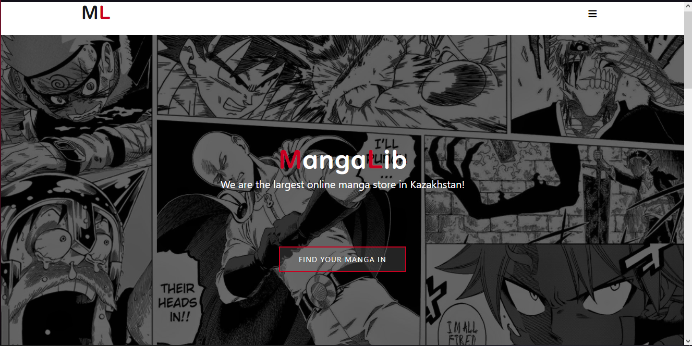
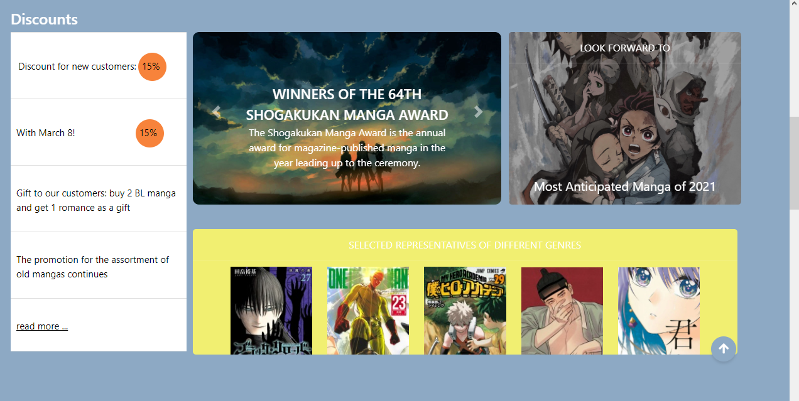
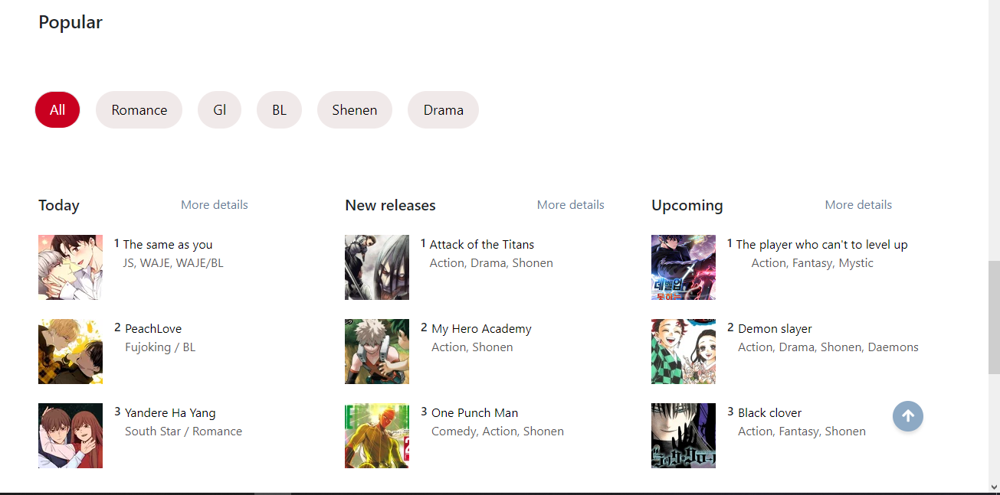
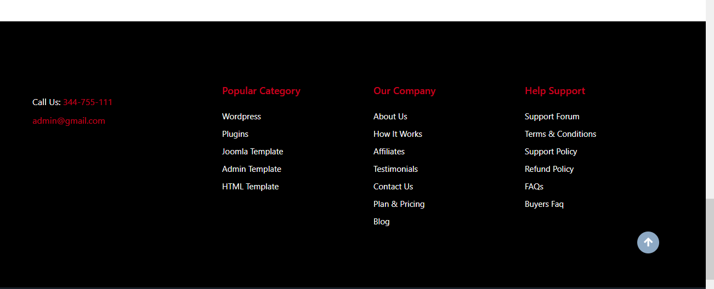

# manga-store
Manga Web Store. It was made as part of the Web course in the 2nd year of the university

Requrements for this project:

* Min DB 5 tables.
* Minimum 1 one-to-many relation(excluding user-role relation).
* Minimum 1 many-to-many relation(excluding user-role relation).
* Login and register processes.
* At least 3 roles(including user and admin), and roles must lead to different resources(pages). Restrict accesses for roles to admin pages.
* Using jquery and bootstrap, flex libraries as minimum.
* Good design and usability.
* Adaptive design, 3 devices minimum (laptop, tablet, mobile)
* Contain searching or ordering or filtering processes.
* Switching between different languages. COOKIES.
* User-role as many-to-many relation.

  
  Main Page

  
  
Second part of the Main Page

  
  
Third part of the Main Page

  
  
Fourth part of the Main Page

